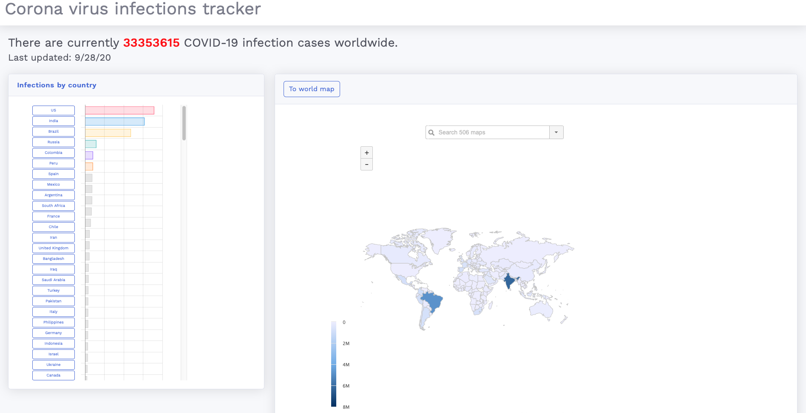
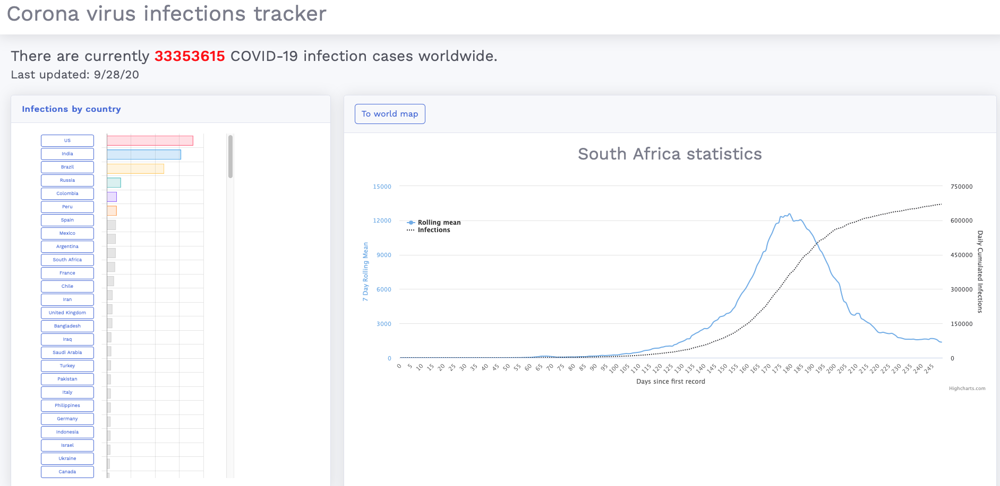

# Corona virus tracker

This is a simple global covid-19 tracker based on python using django as a frontend. The global pandemic is tracked using the [COVID-19 Data Repository by the Center for Systems Science and Engineering (CSSE) at Johns Hopkins University](https://github.com/CSSEGISandData/COVID-19).
For information on how often the data is updated please refer to their github page.

The app allows you to track infection rates by country and also shows some basic statistics on the current infection rates of each monitored country and the world at large.

### The main dashboard

### The statistics dashboard

### Toolkit
- Python 3
- Highcharts
- Chartjs
- Bootstrap